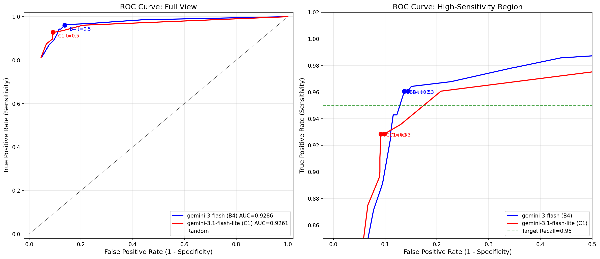
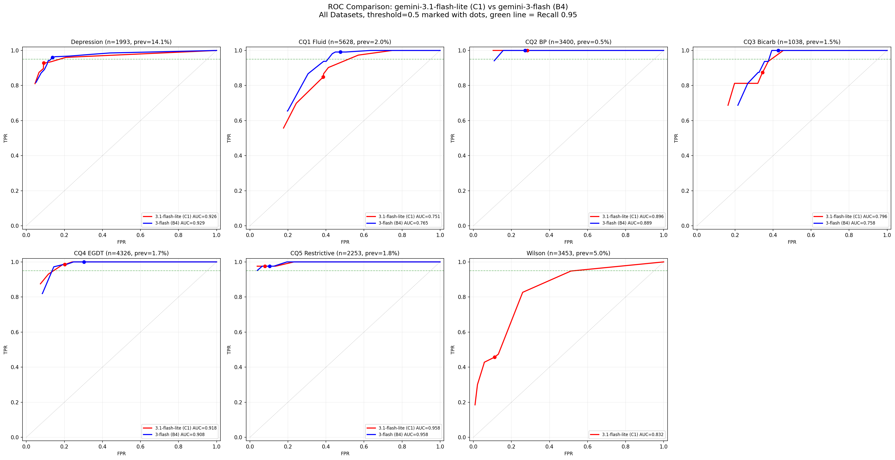
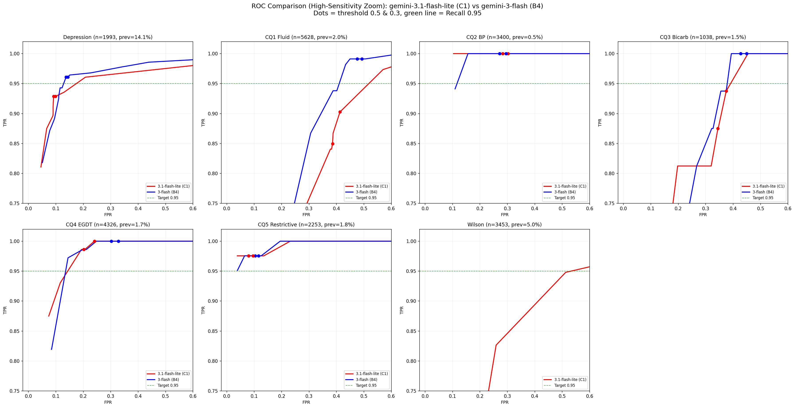

# 実験レポート: gemini-3.1-flash-lite-preview vs gemini-3-flash-preview

**実施日**: 2026-03-05
**実験者**: Claude Code (自動実行)

## 1. 目的

2026-03-03 リリースの `gemini-3.1-flash-lite-preview` が、現行デフォルト `gemini-3-flash-preview` (B4) と同等のスクリーニング精度を達成できるか検証する。

## 2. 実験設計

### Phase 1: depression データセットで最適条件探索

| 条件ID | モデル | Temp | TopP | Thinking |
|---|---|---|---|---|
| C1 | gemini-3.1-flash-lite-preview | 0.0 | — | なし |
| C2 | gemini-3.1-flash-lite-preview | 1.0 | 0.95 | なし |
| C3 | gemini-3.1-flash-lite-preview | 1.0 | 0.95 | MINIMAL |
| C4 | gemini-3.1-flash-lite-preview | 1.0 | 0.95 | LOW |

### Phase 2: 最適条件 (C1) を全データセットで検証

## 3. Phase 1 結果 (depression, n=1993)

| 条件 | Temp | TopP | Thinking | Recall | Precision | Fβ(7) | TP | FP | TN | FN | 時間(s) |
|---|---|---|---|---|---|---|---|---|---|---|---|
| **C1** | 0 | - | - | **92.9%** | 62.4% | 92.0% | 260 | 157 | 1556 | 20 | 30 |
| C4 | 1.0 | 0.95 | LOW | 92.1% | 62.5% | 91.3% | 258 | 155 | 1558 | 22 | 13 |
| C2 | 1.0 | 0.95 | - | 91.4% | 62.3% | 90.6% | 256 | 155 | 1558 | 24 | 22 |
| C3 | 1.0 | 0.95 | MINIMAL | 91.4% | 61.5% | 90.5% | 256 | 160 | 1553 | 24 | 35 |
| **B4 (参考)** | 1.0 | 0.95 | LOW | **96.1%** | 53.4% | 95.0% | 269 | 235 | 1478 | 11 | — |

**最適条件**: C1 (Recall 92.9%)

**所見**:
- 4条件すべてで Recall < 93%。B4 (96.1%) に対し **-3.2pp**。
- Thinking (C3, C4) は精度向上に寄与しなかった。
- C1 (temp=0) が最も安定。

## 4. Phase 2 結果 (全データセット × C1)

### AUC・Recall 比較テーブル

| Dataset | B4 AUC | C1 AUC | AUC差 | B4 Recall@0.5 | C1 Recall@0.5 | Recall差 |
|---|---|---|---|---|---|---|
| depression | 0.9286 | 0.9261 | -0.0025 | 0.961 | 0.929 | **-0.032** |
| cq1 | 0.7653 | 0.7509 | -0.0143 | 0.991 | 0.850 | **-0.142** |
| cq2 | 0.8892 | 0.8962 | +0.0070 | 1.000 | 1.000 | 0.000 |
| cq3 | 0.7581 | 0.7959 | +0.0378 | 1.000 | 0.875 | **-0.125** |
| cq4 | 0.9082 | 0.9182 | +0.0100 | 1.000 | 0.986 | -0.014 |
| cq5 | 0.9578 | 0.9580 | +0.0002 | 0.976 | 0.976 | 0.000 |
| wilson | N/A | 0.8322 | N/A | N/A | 0.457 | N/A |

### Confusion Matrix (threshold=0.5)

| Dataset | Total | C1 TP | C1 FP | C1 TN | C1 FN | C1 Recall | B4 Recall |
|---|---|---|---|---|---|---|---|
| depression | 1,993 | 260 | 157 | 1,556 | 20 | 92.9% | 96.1% |
| cq1 | 5,628 | 96 | 2,127 | 3,388 | 17 | 85.0% | 99.1% |
| cq2 | 3,400 | 17 | 958 | 2,425 | 0 | 100.0% | 100.0% |
| cq3 | 1,038 | 14 | 352 | 670 | 2 | 87.5% | 100.0% |
| cq4 | 4,326 | 71 | 859 | 3,395 | 1 | 98.6% | 100.0% |
| cq5 | 2,253 | 40 | 176 | 2,036 | 1 | 97.6% | 97.6% |
| wilson | 3,451 | 79 | 364 | 2,914 | 94 | 45.7% | — |

### ROC曲線

#### depression 単体比較

#### 全データセット比較

#### 高感度領域拡大（Recall ≥ 0.75）

## 5. 分析

### AUC vs Recall のパラドックス

興味深い点として、**AUCはC1≈B4（一部C1が上回る）にもかかわらず、Recall@0.5ではB4が大幅に優位**。

原因: B4 (gemini-3-flash) は確率分布が二極化しており、陽性文献に高い確率（>0.8）を割り当てる傾向が強い。C1 (3.1-flash-lite) は確率が中間帯（0.3-0.7）に集中し、threshold=0.5 付近での分離が不十分。

→ **Systematic Review では threshold 固定での Recall が重要**であり、AUC が同等でも実用性が異なる。

### データセット別所見

- **cq1, cq3**: Recall が大幅に低下（-14pp, -12.5pp）。低prevalence（<2%）データセットで特に脆弱。
- **cq2, cq5**: B4 と同等の性能を維持。
- **cq4**: ほぼ同等（-1.4pp）。
- **wilson**: Recall 45.7% と極めて低い。wilson は TiAb通過基準（label_tiab）を使用しており、除外基準が複雑（研究デザイン判定）なため、lite モデルでは判別困難。

### 速度面

C1 は全データセットで B4 より**高速**（depression: 30s vs B4推定600s程度）。コスト面でも優位。

## 6. 結論

| 判断基準 | 結果 |
|---|---|
| Recall ≥ 0.95 → デフォルト切り替え | ❌ 未達（最良 92.9%） |
| Recall 0.93-0.95 → フォールバック検討 | ❌ 未達（92.9% < 93%） |
| Recall < 0.93 → 現行構成維持 | ✅ **現行構成維持** |

**gemini-3.1-flash-lite-preview は、systematic review のスクリーニング用途では gemini-3-flash-preview の代替にならない。**

- AUC は同等だが、高Recall 領域での性能が不足
- 特に低prevalenceデータセットで見逃しリスクが増大
- 速度・コスト優位はあるが、Recall 3pp の低下は systematic review では許容困難

**推奨**: 現行デフォルト `gemini-3-flash-preview` (B4: TopP 0.95, Think LOW) を維持。

## 7. ソースコード・元データ

- 実験計画: [plan.md](plan.md)
- 実験設定: [config.json](config.json)
- ランナー: [runner.ts](runner.ts)
- Phase 1 実行: [run_phase1.ts](run_phase1.ts)
- Phase 2 実行: [run_phase2.ts](run_phase2.ts)
- ROC曲線生成: [plot_roc.py](plot_roc.py), [plot_roc_all.py](plot_roc_all.py)
- 結果JSON: [results/](results/) 配下
- 元データセット: `scripts/asreview-baseline/datasets/` 配下
- 比較対象 B4 結果: `experiments/results/decisions_2026-01-01T09-55-41.json` ほか
